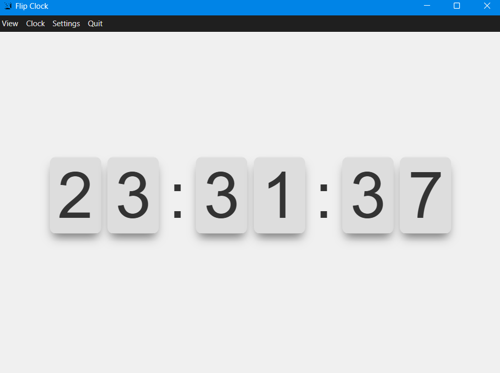

# Electron Flip Clock

A stylish, customizable flip clock application built with Electron. This app provides a clean, animated clock interface that can run in fullscreen mode, prevent display sleep, and offers both light and dark themes.



## Features

- **Animated Flip Clock Interface**: Displays time with an animated flip effect
- **Light and Dark Themes**: Choose between light and dark mode
- **12/24 Hour Format**: Switch between 12-hour and 24-hour time formats
- **Fullscreen Mode**: Perfect for displaying on monitors or as a desktop clock
- **Display Sleep Prevention**: Keeps your screen awake while the clock is active
- **Auto-start Option**: Configure the app to launch automatically on system startup
- **System Tray Integration**: Access the app quickly from the system tray

## Installation

### Prerequisites
- [Node.js](https://nodejs.org/) (v14 or later)
- npm or yarn package manager

### Install from Source
1. Clone this repository:
   ```
   git clone https://github.com/AravinthSS07/FlipClockgit
   ```
2. Navigate to the project directory:
   ```
   cd electronflipclock
   ```
3. Install dependencies:
   ```
   npm install
   ```
4. Start the application:
   ```
   npm start
   ```

### Install Pre-built Binaries
1. Download the latest release for your platform from the [Releases](https://github.com/yourusername/electronflipclock/releases) page
2. Install the application using the provided installer
3. Launch the application

## Usage

- **Open Settings**: Click the "Settings" menu item or use the tray icon
- **Toggle Fullscreen**: Press F11 (or Cmd+F on macOS) or use the menu option
- **Zoom In/Out**: Use the View menu or standard keyboard shortcuts (Ctrl/Cmd + Plus/Minus)
- **System Tray**: Right-click on the tray icon for quick access to common functions

## Configuration

### Available Settings

- **Theme**: Choose between dark and light themes
- **Time Format**: Select 12-hour or 24-hour time format 
- **Start on System Startup**: Enable/disable automatic startup when your computer boots

## Building the Application

To build the application for distribution:

```
npm run build
```

This will create platform-specific packages in the `dist` directory.

## License

This project is licensed under the MIT License - see the LICENSE file for details.

## Author

Created by [aravinthss07](https://github.com/aravinthss07)
